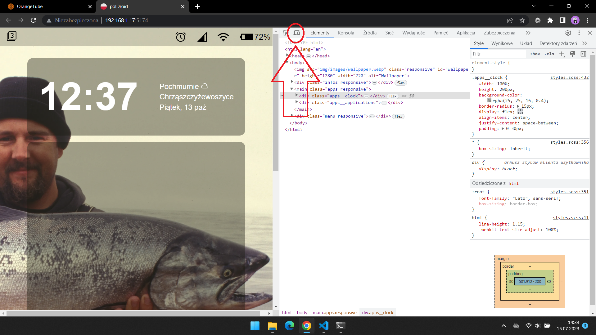

# Poldroid

## To launch the app:
1. git clone git@github.com:Ja-ku-ba/studia.git
2. windows: cd .\studia\z1\
3. npm install
4. npm run dev

### To properly display the content:
1. Open the port on which the application is running, dont be scared
2. Then select the mode: "inspect"
3. 